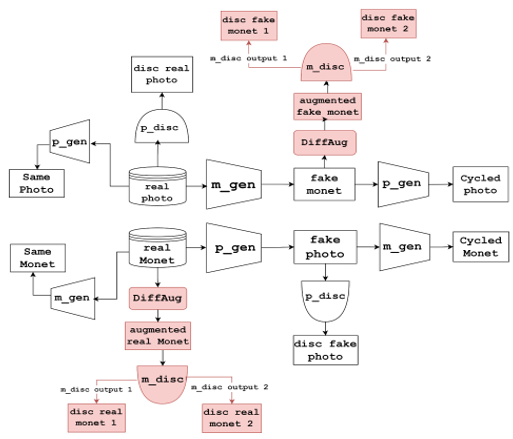

# Art Pieces from GANs Research Project

## Overview

In this GitHub repository, I present an enhanced CycleGAN model with improved image-to-image translation performance, specifically focusing on the [Kaggle Monet dataset](https://www.kaggle.com/your-username/dataset-name). Our initial implementation utilized the CycleGAN model as a baseline, but encountered challenges such as mode collapse.

To address these issues, we innovatively merged concepts from D2GAN and MGAN, creating a Monet discriminator with two output layers and shared parameters. This approach significantly improved performance.

Recognizing the importance of data efficiency, we introduced Differentiable Augmentation, augmenting both target domain samples and generated samples. This step contributed to refining our model.

Our commitment to optimization continued with thorough hyperparameter tuning based on the MiFID metric. The culmination of our efforts yielded an enhanced model with a remarkable MiFID score, ultimately securing the 2nd position in the Kaggle competition.

Explore this repository to delve into the details of the approach and leverage the contributions for your own image translation projects.

## References

## References

- **Paper Title:**
  - **Differentiable Augmentation for Data-Efficient GAN Training:**
    - Author(s): Zhao Zhong, Zizhao Zhang, Cheng Li, Jia-Bin Huang
    - Paper Link: [Differentiable Augmentation for Data-Efficient GAN Training](https://arxiv.org/abs/2006.10738)
    - Official Repository: [Differentiable Augmentation Repository](https://github.com/mit-han-lab/data-efficient-gans)
    
- **Paper Title:**
  - **D2GAN:**
    - Author(s): Min Lin, Zhongyu Li, Ming Yang, Xiaoyu Wang, Shuicheng Yan
    - Paper Link: [D2GAN: Generative Adversarial Networks with Differential Privacy](https://arxiv.org/abs/1711.10561)
    - Official Repository: [D2GAN Repository](https://github.com/MinfengZhu/D2GAN)

- **Paper Title:**
  - **MGAN:**
    - Author(s): Chao Chen, Qian Yu, Dongdong Chen, Yizhou Yu
    - Paper Link: [Memory-augmented Generative Adversarial Networks for Diverse Image Synthesis](https://arxiv.org/abs/1711.06964)
    - Official Repository: [MGAN Repository](https://github.com/McEachernlabs/MGAN)

- **Paper Title:**
  - **CycleGAN:**
    - Author(s): Jun-Yan Zhu, Taesung Park, Phillip Isola, Alexei A. Efros
    - Paper Link: [Unpaired Image-to-Image Translation using Cycle-Consistent Adversarial Networks](https://arxiv.org/abs/1703.10593)
    - Official Repository: [CycleGAN Repository](https://github.com/junyanz/CycleGAN)

This project builds upon CycleGAN. The model is trained within the project using a dataset sourced from Kaggle, which you can download [here](https://www.kaggle.com/your-username/dataset-name). To integrate the dataset into the project for training, follow these steps:

1. Download the dataset from Kaggle.
2. Unzip the downloaded archive.
3. Move the dataset folder in the working directory of this repository.
